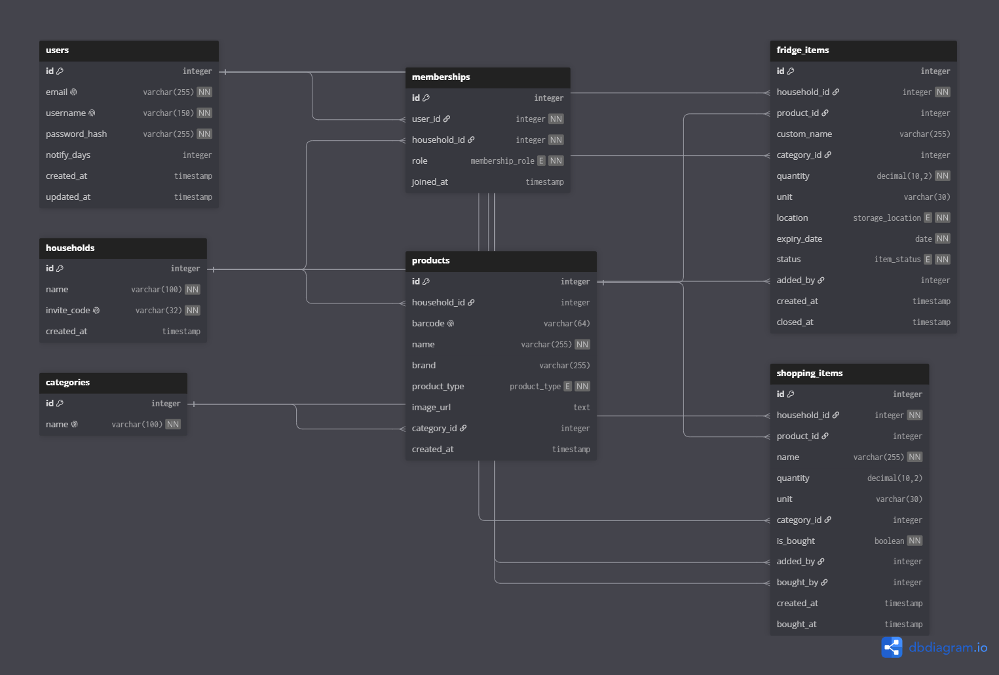

# Common Pantry

Shared Fridge is a cross-platform mobile application connected to a REST API server, designed for housemates and families living together. It enables tracking fridge contents, monitoring expiration dates, minimizing food waste, and managing a shared shopping list in real time.

---

## 🛠️ Tech Stack

- **Backend:** Python 3.11+, Django, Django REST Framework (DRF)
- **Database:** PostgreSQL (Docker Compose)
- **Mobile App:** Flutter (Android / iOS)
- **Authentication:** JWT (JSON Web Tokens)
- **External APIs:** Open Food Facts API (barcode lookup cache)

---

## 🏛️ Database Schema (ERD)

The data model is centered around the `Household` entity. All fridge inventory items and shopping list entries belong strictly to a specific household, ensuring proper data isolation.

### Key Architectural Decisions

1. **Data Isolation:** `FridgeItem` and `ShoppingItem` are strictly bound to `Household`. Members only access resources belonging to their active household.
2. **Global Catalog vs Homemade Dishes:**
   - The `Product` table serves as a global catalog and cache for Open Food Facts barcode scans.
   - For homemade meals (e.g., soups, leftovers) or custom items added manually, `product_id` in `FridgeItem` remains `NULL` while the item details are stored directly in `custom_name` and `category_id`. This prevents polluting the shared global catalog with one-off entries.
3. **Food Waste Tracking (US-21):**
   - Items are never deleted upon consumption or disposal. Instead, their `status` is transitioned to `eaten` or `wasted`, and `closed_at` is recorded to generate waste and consumption analytics.
4. **Performance & Constraints:**
   - A composite index on `(household_id, status, expiry_date)` enables fast sorting and filtering of active items expiring soonest.
   - A unique constraint on `(user_id, household_id)` inside `Membership` guarantees a user cannot join the same household multiple times.

---

